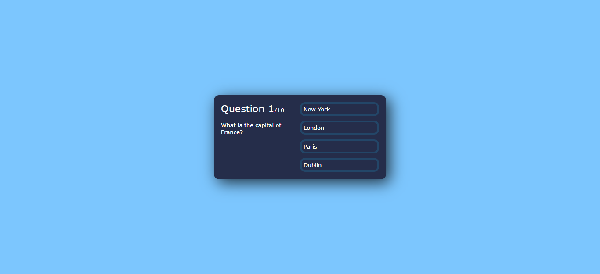

# Quiz React
This quiz was built following the video of [Chris Blakely](https://www.youtube.com/watch?v=Lya-qYiDqIA). The changes I have made to his project were:
- I have created a new file called "questions" to put the array.
- I have added 6 new questions.
- I have added colors to the buttons for when you hit or miss a question using the useState function.

## Display

## What have I learned from this project:
- Managing complex state objects
- Conditionally rendering elements
- Working with multiple state hooks to create a dynamic UI
